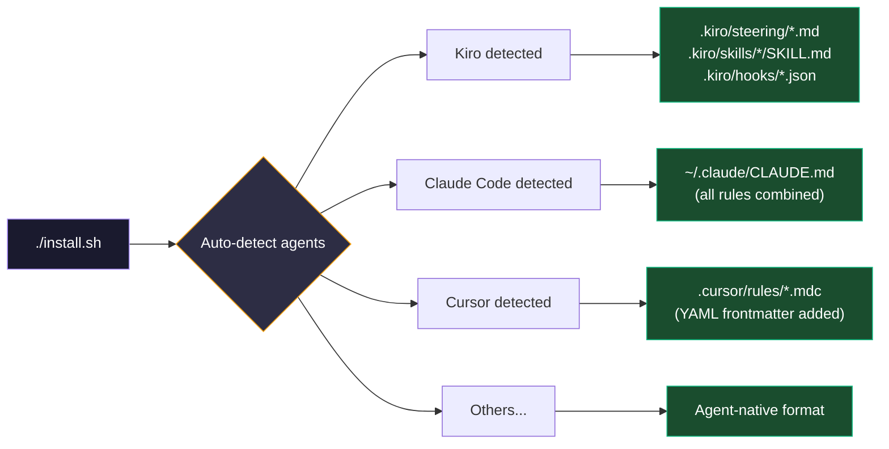
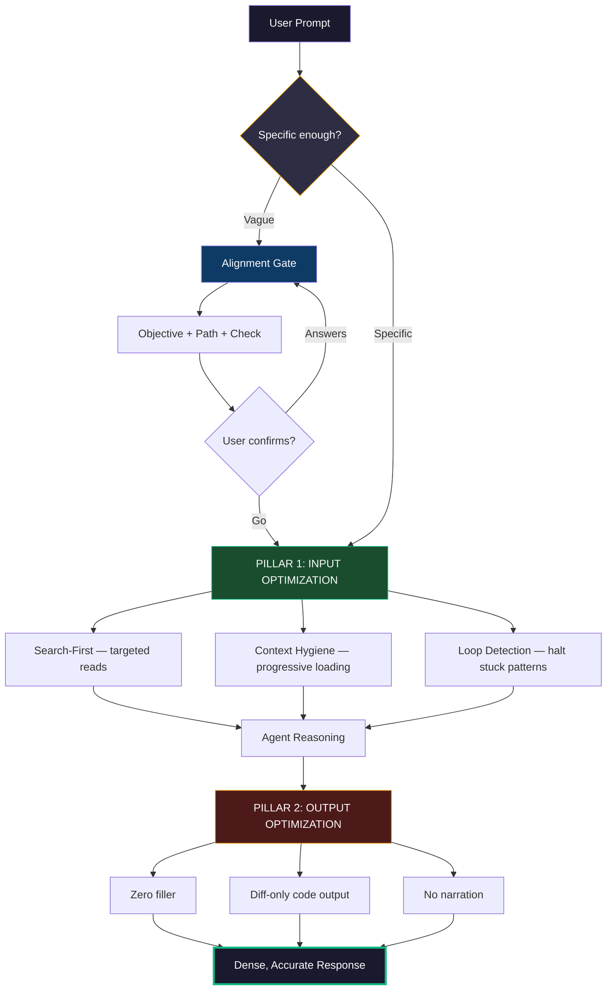
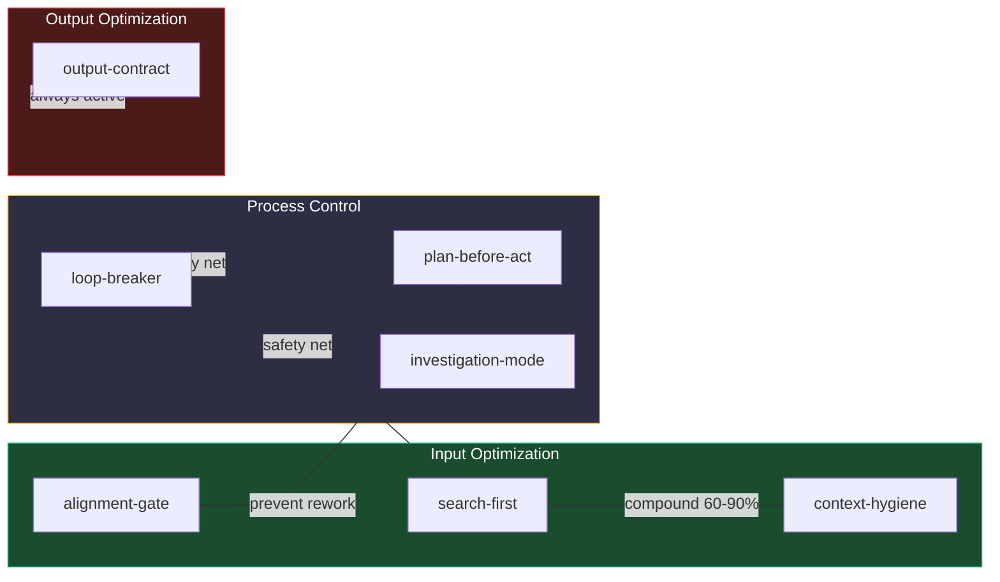
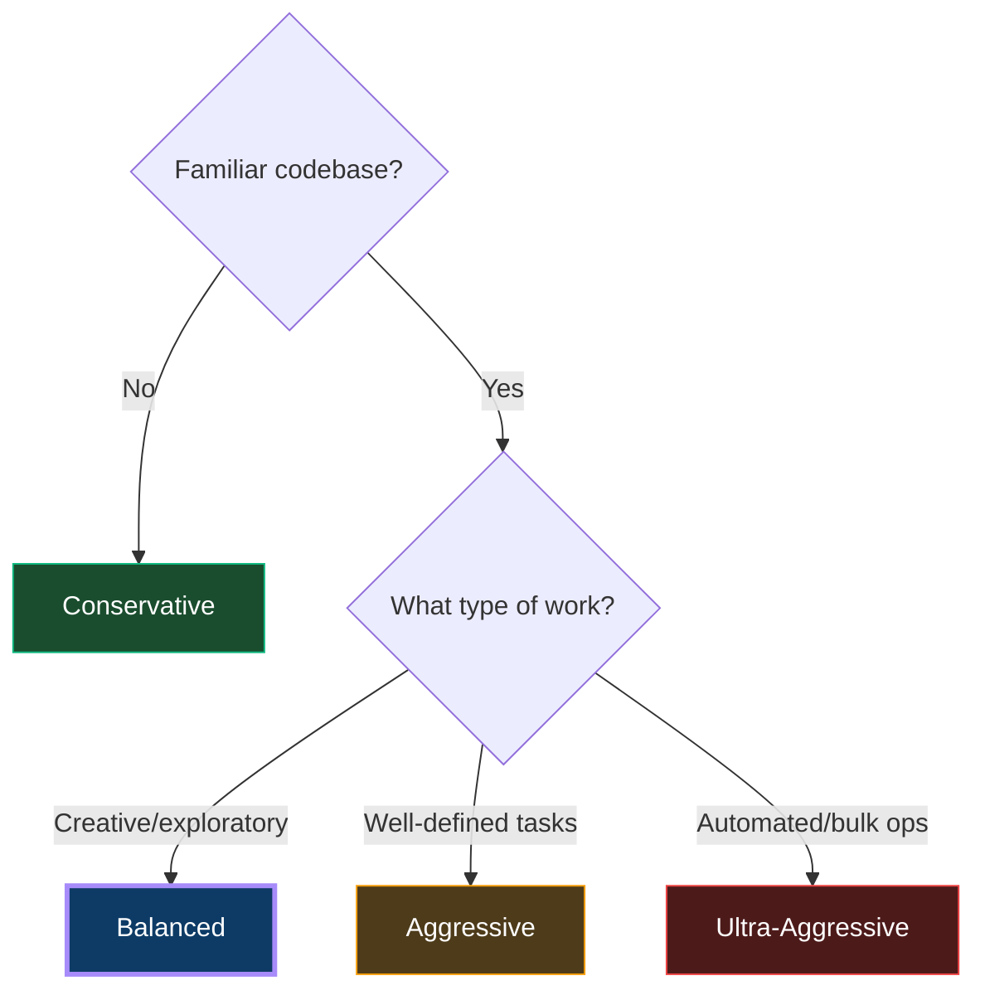
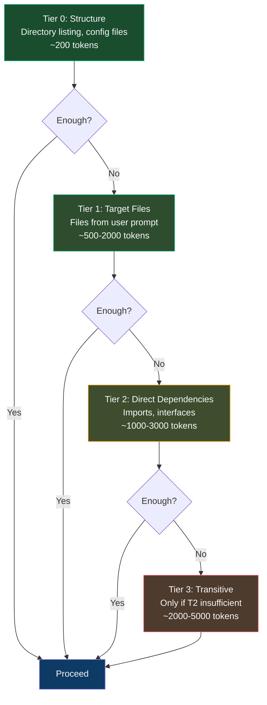

<p align="center">
  <strong>⚡ ContextSect</strong><br/>
  <em>Agent-agnostic token optimization. One framework, every AI coding client.</em>
</p>

<p align="center">
  <a href="#install"></a>
  <a href="#supported-agents"></a>
  <a href="#rules"></a>
  <a href="#results"></a>
  <a href="#research-basis"></a>
</p>

---

## What Is This?

ContextSect is a **universal token optimization framework** that works across all major AI coding agents. Write rules once → install everywhere → save 45–60% tokens regardless of which client you use.

> **The problem:** Every AI coding tool has its own config format — `CLAUDE.md`, `.cursorrules`, `.windsurf/rules/`, `.clinerules/`, `.kiro/steering/`, `AGENTS.md`... but the optimization rules are the SAME regardless of agent.
> 
> **The solution:** Universal rules in plain markdown → auto-adapted to each agent's native format on install.

---

## Supported Agents

| Agent | Config Format | Install Location | Auto-Detected? |
|-------|---|---|:---:|
| **Kiro** | `.kiro/steering/*.md` + skills + hooks | `~/.kiro/` | ✅ |
| **Claude Code** | `CLAUDE.md` (single markdown) | `~/.claude/CLAUDE.md` | ✅ |
| **Cursor** | `.mdc` files with YAML frontmatter | `~/.cursor/rules/` | ✅ |
| **Windsurf** | Plain markdown in rules directory | `~/.windsurf/rules/` | ✅ |
| **Cline** | Plain markdown in rules directory | `~/.clinerules/` | ✅ |
| **OpenCode** | Single markdown file | `~/opencode.md` | ✅ |
| **Aider** | YAML config + conventions markdown | `~/.aider.conventions.md` | ✅ |
| **RooCode** | Plain markdown in rules directory | `~/.roo/rules/` | ✅ |
| **GitHub Copilot** | Instructions markdown | `~/.github/copilot-instructions.md` | ✅ |
| **OpenAI Codex** | AGENTS.md | `~/AGENTS.md` | ✅ |

---

## Install

```bash
git clone https://github.com/BhavanPatel/ContextSect.git
cd ContextSect
./install.sh
```

The script **auto-detects** which agents you have installed and configures each one in its native format.

### What Happens



### Manual Agent Selection

If auto-detection doesn't find your agents, the script falls back to interactive selection:

```
Available agents:
  1) Kiro CLI
  2) Claude Code
  3) Cursor
  4) Windsurf
  5) Cline
  6) OpenCode
  7) Aider
  8) RooCode
  9) GitHub Copilot
 10) OpenAI Codex
  a) All

Select agents (comma-separated numbers, or 'a' for all): 1,2,3
```

### Explicit Agent Selection

```bash
./install.sh --agent kiro,claude-code,cursor
```

---

## Why This Exists

### The Token Economics Problem

```
Input tokens:  $3 per million  (what the model reads)
Output tokens: $15 per million (what the model generates) ← 5x more expensive
```

AI coding agents waste tokens in five systematic ways:

| Problem | Token Waste | Root Cause |
|---------|:-:|---|
| **Wrong direction** | 5,000–50,000 per occurrence | Vague prompt → agent guesses → wrong implementation → redo |
| **Context pollution** | 40–80% of input tokens | Reading full files when only one function matters |
| **Output bloat** | 40–65% of output tokens | Filler, restatements, full-file rewrites, narration |
| **Runaway loops** | 10x–100x normal usage | Stuck tool calls repeating without progress |
| **Session accumulation** | 30–50% over long sessions | Old context never pruned, resent every turn |

These problems are **agent-agnostic** — they happen in Kiro, Claude Code, Cursor, and every other tool the same way.

---

## Architecture

### Two-Pillar Design



**Pillar 1 — Input Optimization:** Prevents unnecessary context expansion BEFORE work begins.
- Alignment gate catches vague prompts
- Search-first prevents full-file reads
- Progressive loading loads context in tiers
- Loop detection halts stuck patterns

**Pillar 2 — Output Optimization:** Minimizes generated tokens AFTER reasoning.
- Zero conversational filler
- SEARCH/REPLACE diffs (never full files)
- No tool-call narration
- Explain only when explicitly asked

### How Rules Get Adapted Per Agent

The same rule (`rules/output-contract.md`) becomes:

| Agent | Transformation | Result |
|-------|---|---|
| **Kiro** | → steering file + SKILL.md + hook | `.kiro/steering/output-contract.md` |
| **Claude Code** | → combined into single CLAUDE.md | `~/.claude/CLAUDE.md` |
| **Cursor** | → .mdc with YAML frontmatter | `.cursor/rules/9output-contract.mdc` |
| **Windsurf** | → plain markdown copy | `.windsurf/rules/output-contract.md` |
| **Cline** | → plain markdown copy | `.clinerules/output-contract.md` |
| **RooCode** | → plain markdown copy | `.roo/rules/output-contract.md` |
| **Aider** | → combined conventions file | `~/.aider.conventions.md` |
| **OpenCode** | → combined markdown | `~/opencode.md` |
| **GitHub Copilot** | → combined instructions | `~/.github/copilot-instructions.md` |
| **Codex** | → combined AGENTS.md | `~/AGENTS.md` |

---

## Results

| Metric | Before | After | Evidence |
|--------|:------:|:-----:|----------|
| Input tokens per task | Baseline | **-40–55%** | Progressive loading + search-first |
| Output tokens per task | Baseline | **-50–65%** | Compression + diff-only |
| Total cost per session | Baseline | **-45–60%** | Weighted by 5x output multiplier |
| First-attempt success | ~60% | **~85%** | Alignment prevents rework |
| Runaway loops | Occasional | **Near zero** | Loop-breaker detection |

---

## Rules

7 universal rules — each works independently across all agents.

| Rule | Purpose | Input Savings | Output Savings |
|------|---------|:---:|:---:|
| **output-contract** | Zero filler, no narration, explain only when asked | — | -40–65% |
| **diff-only** | SEARCH/REPLACE format, never full files | — | -60–90% code |
| **alignment-gate** | Clarify before complex tasks | -50–70% rework | -50–70% rework |
| **search-first** | Targeted search before file reads | -40–80% | -20–30% |
| **loop-breaker** | Halt stuck execution patterns | ∞ prevention | ∞ prevention |
| **plan-before-act** | Plan multi-file changes | +5% planning | -50–70% rework |
| **investigation-mode** | Evidence-first debugging | -40–60% | -50% |
| **context-hygiene** | Progressive loading, session awareness | -30–50% | indirect |

### Rule Synergies



---

## Examples

### Alignment Gate in Action

**Your prompt:** "refactor the auth module"

**Without ContextSect:** Agent reads 12 files, implements session-based refactor. You wanted JWT migration. 15,000 tokens wasted.

**With ContextSect:**
```
Objective: Extract token validation into standalone middleware, removing duplication.

Path:
1. Create src/middleware/auth-validator.ts
2. Update src/routes/users.ts — replace inline validation
3. Update src/routes/admin.ts — same
4. Update src/routes/api.ts — same

Check: Should this maintain session-based auth, or migrate to stateless JWT?

→ "Go" to proceed, or answer the question.
```
**Cost:** 100 tokens. **Prevented:** 15,000 tokens wrong direction.

### Output Contract — Before/After

**Without ContextSect (1,200 tokens):**
```
Sure! I'd be happy to help you with that bug. Let me take a look at the code.

After examining the auth middleware, I can see that the issue is in the token
expiry check. The problem is that you're using `<` instead of `<=`...

Here's the updated file:
[entire 200-line file]

In summary, the fix was changing < to <=. Let me know if you need anything else!
```

**With ContextSect (80 tokens):**
```
Bug: token expiry uses `<` not `<=`. Tokens at exact current timestamp pass validation.

File: src/middleware/auth.ts

<<<<<<< SEARCH
if (decoded.exp < Date.now() / 1000) {
=======
if (decoded.exp <= Date.now() / 1000) {
>>>>>>> REPLACE
```

**93% reduction. Same fix. Same accuracy.**

### Search-First — Token Impact

```
WITHOUT search-first:
  Read auth.ts (450 lines)     → 1,800 tokens
  Read user.ts (380 lines)     → 1,520 tokens  
  Read session.ts (200 lines)  → 800 tokens
  Total: 4,120 tokens (needed only 60 lines)

WITH search-first:
  Symbol lookup "validateToken" → line 145-167
  Read auth.ts:140-170         → 120 tokens
  Grep "refreshSession"        → line 89-102
  Read session.ts:84-107       → 92 tokens
  Total: 212 tokens (95% reduction)
```

---

## Project Structure

```
ContextSect/
├── rules/                          # Universal rules (agent-agnostic markdown)
│   ├── output-contract.md          # Zero filler, explain only when asked
│   ├── diff-only.md                # SEARCH/REPLACE, never full files
│   ├── alignment-gate.md           # Clarify before complex tasks
│   ├── search-first.md             # Targeted search before reads
│   ├── loop-breaker.md             # Halt stuck patterns
│   ├── plan-before-act.md          # Plan multi-file changes
│   ├── investigation-mode.md       # Evidence-first debugging
│   └── context-hygiene.md          # Progressive loading
├── adapters/                       # Agent-specific transformations
│   └── kiro-hooks.json             # Kiro v3 hooks (only agent needing hooks)
├── docs/                           # Reference documentation
│   ├── 01-research-summary.md      # 17 findings with full citations
│   ├── 03-skill-library.md         # Complete rule specs + compatibility matrix
│   ├── 04-configuration-profiles.md # 4 profiles with YAML + risk analysis
│   └── 06-final-recommendation.md  # Production deployment guide
├── install.sh                      # Auto-detect + install for all agents
└── README.md
```

---

## How Adaptation Works

### Agents that use plain markdown (no transformation needed)
Windsurf, Cline, RooCode — rules copied directly as `.md` files.

### Agents that combine into single file
Claude Code, OpenCode, Aider, GitHub Copilot, Codex — all rules concatenated into one markdown file in their expected location.

### Agents needing format transformation

**Cursor** — adds YAML frontmatter for activation:
```yaml
---
description: "Token optimization: output-contract"
globs:
alwaysApply: true
---

# Output Contract
[rule content]
```

**Kiro** — full native integration:
- Rules → `.kiro/steering/*.md` (always loaded)
- Rules → `.kiro/skills/*/SKILL.md` (with frontmatter for routing)
- Hooks → `.kiro/hooks/token-optimization.json` (triggers on UserPromptSubmit, PreToolUse)

---

## Configuration Profiles

4 pre-configured intensity levels — works with any agent:

| Profile | Input ↓ | Output ↓ | Risk | Best For |
|---------|:-------:|:--------:|:----:|----------|
| **Conservative** | 15–25% | 20–30% | Zero | Learning, prototyping, unfamiliar codebases |
| **Balanced** ⭐ | 40–55% | 50–65% | Low | Daily development (recommended default) |
| **Aggressive** | 60–75% | 70–85% | Medium | Cost-sensitive, familiar codebases |
| **Ultra-Aggressive** | 80–90% | 85–95% | High | Automated agents, bulk operations |

### How to Choose



See [docs/04-configuration-profiles.md](docs/04-configuration-profiles.md) for full YAML configs and risk analysis.

---

## Progressive Context Loading

One of the most powerful techniques — load context in tiers, never all at once:



**Why:** The "Lost in the Middle" paper shows models pay most attention to beginning and end of context. Loading everything fills the middle with noise that DEGRADES quality. Less context = better reasoning.

---

## Implementation Priority

### Week 1 — Immediate, Zero Risk
| Rule | Impact |
|------|--------|
| `output-contract` | -40–65% output tokens instantly |
| `diff-only` | -60–90% code output tokens |
| `alignment-gate` | Prevents wrong-direction waste |

### Week 2 — After Validating
| Rule | Validates |
|------|-----------|
| `search-first` | File read patterns improve |
| `loop-breaker` | Stuck patterns caught |
| `plan-before-act` | Multi-file alignment |

### Week 3+ — Tune Thresholds
- If alignment gate fires too often (>50%): raise file-count threshold
- If loop-breaker false-positives: raise repetition threshold
- If sessions still bloat: enable `context-hygiene` strictly

---

## What NOT to Do

| Anti-Pattern | Why It Fails | Evidence |
|---|---|---|
| **Ultra-compressed abbreviations** (cfg/impl/req/fn) | Tokenizer splits to same count as full words. Zero savings, lost readability. | Caveman repo tokenizer analysis |
| **Hard file-read limits** (max 3 files) | Agent misses dependencies → wrong code → retry costs more | AgentDiet research |
| **Forced single-task sessions** | Session overhead = 3,000–5,000 tokens. Repeated per task. | Kiro/Claude session architecture |
| **Compressing security warnings** | Misunderstood destructive confirmations → data loss | GitHub incident docs |
| **Loading all rules simultaneously** | Each rule = 300–400 tokens. 20 rules = 8,000 tokens competing for attention | SkillReducer: attention dilution |

---

## Documentation

| Doc | Contents |
|-----|----------|
| [**Research Summary**](docs/01-research-summary.md) | 17 evidence-backed findings with sources, classification, and measured impact |
| [**Rule Library**](docs/03-skill-library.md) | Complete specs for all rules: rationale, risks, activation, compatibility matrix |
| [**Configuration Profiles**](docs/04-configuration-profiles.md) | 4 profiles with YAML configs, risk assessments, decision flowchart |
| [**Final Recommendation**](docs/06-final-recommendation.md) | Always-on vs task-specific, what to avoid, optimal defaults |

---

## Research Basis

Built on evidence from peer-reviewed papers and production measurements:

| Source | Key Finding | Confidence |
|--------|-------------|:---:|
| [SkillReducer](https://arxiv.org/abs/2603.29919) (55k skills) | 60% of skill content is non-actionable waste | Proven |
| [AGENTS.md Impact](https://arxiv.org/abs/2601.20404) (124 PRs) | 17% output reduction, 29% runtime reduction | Proven |
| [Context Engineering](https://arxiv.org/abs/2606.10209) | Pruning context: 64% fewer tokens, +8% completion | Proven |
| [GitHub Agentic Workflows](https://github.blog/ai-and-ml/github-copilot/improving-token-efficiency-in-github-agentic-workflows/) | 62% savings eliminating unnecessary tool turns | Proven |
| [Caveman Skill](https://github.com/JuliusBrussee/caveman) (83k ⭐) | 65% output reduction benchmarked | Proven |
| [Lost in the Middle](https://arxiv.org/html/2307.03172) | Context position affects quality (beginning/end > middle) | Proven |
| [Prompt Caching](https://claude.com/blog/lessons-from-building-claude-code-prompt-caching-is-everything) | 60–90% input cost reduction with stable prefixes | Proven |
| [AgentDiet](https://arxiv.org/abs/2509.23586v1) | 40–60% input reduction, same performance | Proven |

---

## Updating

```bash
cd ContextSect
git pull
./install.sh    # Re-installs with latest rules (backs up existing files)
```

---

## Adding New Agents

To add support for a new agent:

1. Add detection logic in `detect_agents()` function
2. Create `install_<agent>()` function implementing the agent's config format
3. Add to the `main()` case statement

The universal rules in `rules/` don't need to change — only the installation adapter.

---

## Quick Reference

```bash
# Auto-detect and install
./install.sh

# Install for specific agents only
./install.sh --agent kiro,claude-code,cursor

# Update after pulling new rules
git pull && ./install.sh
```

---

## Author

<p>
  <a href="https://github.com/BhavanPatel"><strong>Bhavan Patel</strong></a>
</p>

## License

MIT
