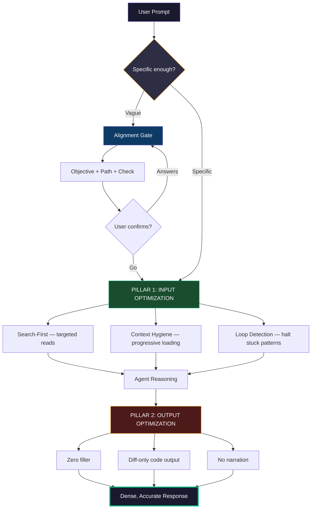

# Architecture

## Two-Pillar Design



---

## Pillar 1 — Input Optimization

Prevents unnecessary context expansion BEFORE work begins.

- **Alignment gate** catches vague prompts
- **Search-first** prevents full-file reads
- **Progressive loading** loads context in tiers
- **Loop detection** halts stuck patterns

## Pillar 2 — Output Optimization

Minimizes generated tokens AFTER reasoning.

- Zero conversational filler
- SEARCH/REPLACE diffs (never full files)
- No tool-call narration
- Explain only when explicitly asked

---

## The Token Economics Problem

```
Input tokens:  $3 per million  (what the model reads)
Output tokens: $15 per million (what the model generates) ← 5x more expensive
```

AI coding agents waste tokens in five systematic ways:

| Problem | Token Waste | Root Cause |
|---------|:-:|---|
| **Wrong direction** | 5,000–50,000 per occurrence | Vague prompt → agent guesses → wrong implementation → redo |
| **Context pollution** | 40–80% of input tokens | Reading full files when only one function matters |
| **Output bloat** | 40–65% of output tokens | Filler, restatements, full-file rewrites, narration |
| **Runaway loops** | 10x–100x normal usage | Stuck tool calls repeating without progress |
| **Session accumulation** | 30–50% over long sessions | Old context never pruned, resent every turn |

These problems are **agent-agnostic** — they happen in Kiro, Claude Code, Cursor, and every other tool the same way.
