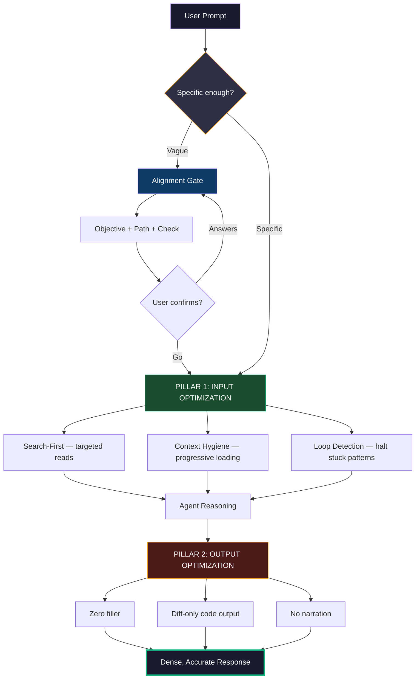

# Architecture

## Two-Pillar Design


```mermaid
flowchart TD
    A[User Prompt] --> B{Specific enough?}
    
    B -->|Vague| C[Alignment Gate]
    C --> D["Objective + Path + Check"]
    D --> E{User confirms?}
    E -->|Go| F
    E -->|Answers| C
    
    B -->|Specific| F[PILLAR 1: INPUT OPTIMIZATION]
    
    F --> F1[Search-First — targeted reads]
    F --> F2[Context Hygiene — progressive loading]
    F --> F3[Loop Detection — halt stuck patterns]
    
    F1 --> G[Agent Reasoning]
    F2 --> G
    F3 --> G
    
    G --> H[PILLAR 2: OUTPUT OPTIMIZATION]
    
    H --> H1[Zero filler]
    H --> H2[Diff-only code output]
    H --> H3[No narration]
    
    H1 --> I[Dense, Accurate Response]
    H2 --> I
    H3 --> I

    style A fill:#1a1a2e,stroke:#a78bfa,color:#fff
    style B fill:#2d2d44,stroke:#f59e0b,color:#fff
    style C fill:#0d3b66,stroke:#a78bfa,color:#fff
    style F fill:#1a4d2e,stroke:#10b981,color:#fff
    style H fill:#4d1a1a,stroke:#f59e0b,color:#fff
    style I fill:#1a1a2e,stroke:#10b981,color:#fff,stroke-width:3px
```

---

## Pillar 1 — Input Optimization

Prevents unnecessary context expansion BEFORE work begins.

- **Alignment gate** catches vague prompts
- **Search-first** prevents full-file reads
- **Progressive loading** loads context in tiers
- **Loop detection** halts stuck patterns

## Pillar 2 — Output Optimization

Minimizes generated tokens AFTER reasoning.

- Zero conversational filler
- SEARCH/REPLACE diffs (never full files)
- No tool-call narration
- Explain only when explicitly asked

---

## The Token Economics Problem

```
Input tokens:  $3 per million  (what the model reads)
Output tokens: $15 per million (what the model generates) ← 5x more expensive
```

AI coding agents waste tokens in five systematic ways:

| Problem | Token Waste | Root Cause |
|---------|:-:|---|
| **Wrong direction** | 5,000–50,000 per occurrence | Vague prompt → agent guesses → wrong implementation → redo |
| **Context pollution** | 40–80% of input tokens | Reading full files when only one function matters |
| **Output bloat** | 40–65% of output tokens | Filler, restatements, full-file rewrites, narration |
| **Runaway loops** | 10x–100x normal usage | Stuck tool calls repeating without progress |
| **Session accumulation** | 30–50% over long sessions | Old context never pruned, resent every turn |

These problems are **agent-agnostic** — they happen in Kiro, Claude Code, Cursor, and every other tool the same way.


---

## The Third Lever: Cache Stability

The two-pillar model above treats input cost as a function of **how much** context is loaded. That is incomplete. Provider prompt caching means input cost is also a function of **how stable** the context is.

Cache reads cost roughly 10% of normal input price. Matching is a byte-exact prefix comparison, so a single changed character early in the prompt invalidates every cached token after it.

```
Input tokens (uncached):    $3.00 per million
Input tokens (cache read):  ~$0.30 per million   ← 10x cheaper
```

This reframes the always-on cost of rules:

| Action | Effect |
|---|---|
| Remove 30% of a stable prefix | ~30% off an already-discounted rate |
| Change one byte early in the prefix | full price on 100% of it |

**Stability dominates size.** A larger stable prefix is cheaper than a smaller volatile one.

### What this changed in the implementation

1. **No timestamp in the profile header.** `install.sh` previously wrote `# Generated: <date>` at the top of `000-profile.md`, the first file in the cached prefix. That invalidated the cache daily, for no benefit.
2. **Deterministic rule ordering.** Rules are enumerated with `LC_ALL=C sort` rather than locale-dependent glob order, so the prefix is byte-identical across machines and runs.

The `cache-stability` rule extends the same discipline to runtime behaviour: append rather than edit, cite `path:line` rather than paste changing content, and never re-summarise history into the prefix.

### Why this is the honest answer to "it's always loaded"

The criticism assumes always-on content is charged at full price every turn. With a stable prefix it is charged at roughly a tenth. So the answer is two-part:

1. Load less — tiering cuts always-on content from 14 rules to 2 (see [tiering.md](tiering.md))
2. Keep what remains byte-stable, so it bills at cache-read rates

Neither alone is sufficient. Tiering without stability just shrinks a full-price payload; stability without tiering pays a discounted rate on content that was never needed.
