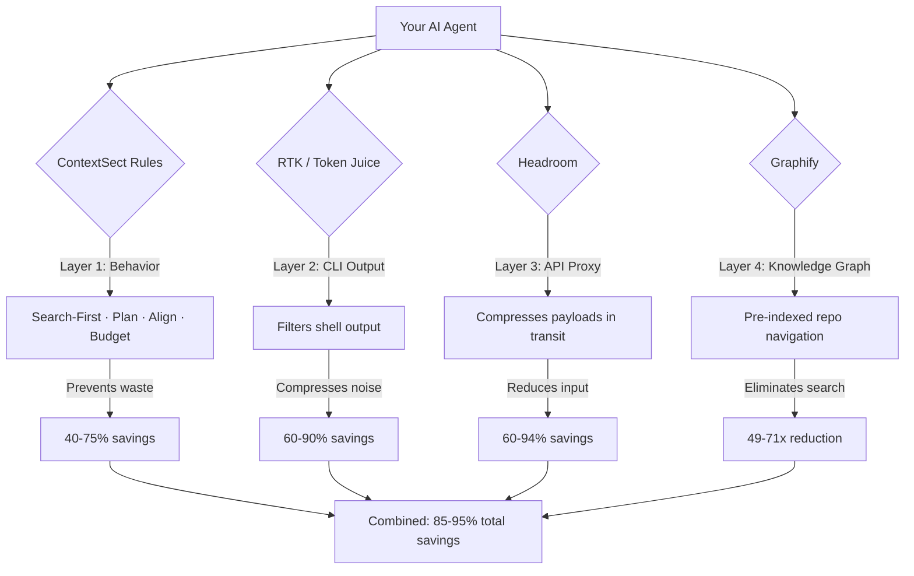

# Companion Stack

ContextSect is the **rules layer** — it governs agent behavior through behavioral instructions. But token optimization has multiple layers, and some require runtime binaries or proxies that rules alone cannot replicate.

This guide explains how to combine ContextSect with companion tools for maximum savings.

## The Full Stack



Each layer operates independently. Stack them for compounding savings.

## Layer Breakdown

### Layer 1: ContextSect (this project)

**What it does:** Behavioral rules that teach agents to search before reading, plan before acting, use compact commands, avoid loops, output diffs instead of full files, and manage context budgets.

**Why it's the foundation:** Every other layer compresses tokens after they're already committed. ContextSect prevents tokens from being consumed in the first place. A 200-token plan prevents a 10,000-token wrong implementation. No binary can do this.

**Install:** See main [README](../README.md).

---

### Layer 2: CLI Output Compression

Choose ONE of:

#### RTK (Rust Token Killer)
- **Repo:** [github.com/rtk-ai/rtk](https://github.com/rtk-ai/rtk)
- **What:** Rust binary that intercepts shell commands and compresses their output before it enters context
- **Savings:** 60-90% on command outputs (git, npm, pytest, cargo, docker, etc.)
- **Install:** `brew install rtk` then `rtk init -g`
- **How it works:** Hooks into your agent's Bash tool. `git status` becomes `rtk git status` automatically. Output is filtered, grouped, and truncated.

#### Token Juice
- **Repo:** [github.com/vincentkoc/tokenjuice](https://github.com/vincentkoc/tokenjuice)
- **What:** Rule-driven output compactor with JSON-configurable reducers
- **Savings:** Similar to RTK — compacts terminal noise
- **Install:** `tokenjuice install claude-code` (or your agent)
- **How it works:** Observes command output post-execution, applies reducer rules, returns compact payload. Rules are inspectable JSON.

**Which to choose:**
- RTK if you want a single zero-dependency binary with 100+ built-in command filters
- Token Juice if you want configurable JSON rules and broader host integrations (40+ agents)

---

### Layer 3: API-Level Compression

#### Headroom
- **Repo:** [github.com/chopratejas/headroom](https://github.com/bsmr/chopratejas---headroom)
- **What:** Local proxy that compresses context payloads before they hit the LLM API
- **Savings:** 60-94% on input tokens
- **Install:** `pip install headroom-ai` then `headroom wrap claude`
- **How it works:** Sits between agent and provider. Intercepts requests, compresses bulky tool outputs/logs/JSON blobs into information-dense representations. Model can request original back on demand.

**When to use:** When your sessions regularly hit compaction thresholds despite using ContextSect + RTK. Headroom catches the remaining bloat from tool responses, RAG chunks, and conversation history.

---

### Layer 4: Codebase Knowledge Graph

#### Graphify
- **Repo:** [github.com/safishamsi/graphify](https://github.com/safishamsi/graphify) (PyPI: `graphifyy`)
- **What:** Pre-compiles your codebase into a queryable knowledge graph
- **Savings:** 49-71x token reduction on large repos (verified benchmarks)
- **Install:** `pip install graphifyy` then `graphify index .`
- **How it works:** Builds a structural graph of your entire repo (code, docs, PDFs). Agent navigates by structure instead of grep. One graph query replaces eight Glob calls.

**When to use:** Repos with 100+ files where the agent repeatedly searches for relationships. The graph eliminates the "finding things" phase entirely.

**Note:** ContextSect's `search-first` rule includes graph awareness — if Graphify is present, the agent will prefer graph queries over raw file reads automatically.

---

## Stacking Examples

### Minimal (just ContextSect)
```bash
curl -fsSL https://context-sect.dev/install.sh | bash
```
Expected savings: 40-75% (behavior-only)

### Recommended (ContextSect + RTK)
```bash
curl -fsSL https://context-sect.dev/install.sh | bash
brew install rtk && rtk init -g
```
Expected savings: 70-90% (behavior + command compression)

### Maximum (full stack)
```bash
curl -fsSL https://context-sect.dev/install.sh | bash
brew install rtk && rtk init -g
pip install headroom-ai && headroom wrap claude
pip install graphifyy && graphify index .
```
Expected savings: 85-95%+ (all layers active)

---

## How They Interact

| Scenario | Without stack | With full stack |
|----------|--------------|-----------------|
| Find a function in 500-file repo | Agent reads 10 files (~50K tokens) | Graph query → 1 targeted read (~500 tokens) |
| Run `npm test` (passes) | 25,000 tokens of test output | RTK: 2,500 tokens. ContextSect: agent asked for `--quiet` first |
| Fix a bug | Agent reads 5 files fully, outputs whole file | ContextSect: reads 3 sections. Outputs SEARCH/REPLACE diff |
| 30-turn session with tool calls | ~350K tokens, 2 compactions | ContextSect: budget-aware, fresh session recommended at turn 20 |

---

## FAQ

**Q: Do these tools conflict with each other?**
No. They operate at different layers. ContextSect governs behavior (system prompt), RTK intercepts commands (shell hook), Headroom compresses API payloads (HTTP proxy), Graphify pre-indexes (offline build step). They never touch the same data path.

**Q: Do I need all of them?**
No. ContextSect alone provides significant savings. Each additional layer is diminishing returns. Start with ContextSect + RTK (covers 80% of waste). Add Headroom/Graphify only if you're still hitting budget issues on large projects.

**Q: Will RTK/Token Juice conflict with ContextSect's shell-output-hygiene rule?**
They complement. ContextSect tells the agent to use `--quiet` flags proactively. RTK compresses whatever output remains. Double optimization on the same path — both help.

**Q: I already use Caveman. Should I switch to ContextSect?**
ContextSect's `output-contract` rule does everything Caveman does (compressed prose) plus it knows when NOT to compress (security warnings, multi-step instructions). You can safely replace Caveman with ContextSect. You don't need both.
