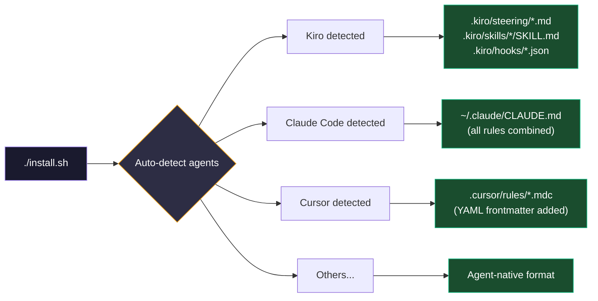

# Installation

## Quick Start

```bash
curl -sL https://contextsect.vercel.app/install.sh | bash
```

The script **auto-detects** which agents you have installed and configures each one in its native format.

---

## What Happens



---

## Manual Agent Selection

If auto-detection doesn't find your agents, the script falls back to interactive selection:

```
Available agents:
  1) Kiro CLI
  2) Claude Code
  3) Cursor
  4) Windsurf
  5) Cline
  6) OpenCode
  7) Aider
  8) RooCode
  9) GitHub Copilot
 10) OpenAI Codex
  a) All

Select agents (comma-separated numbers, or 'a' for all): 1,2,3
```

## Explicit Agent Selection

```bash
./install.sh --agent kiro,claude-code,cursor
```

---

## CLI Reference

```bash
# Auto-detect and install (interactive profile selection)
./install.sh

# Install with specific profile (non-interactive)
./install.sh --profile balanced

# Install for specific agents with profile
./install.sh --agent kiro,claude-code,cursor --profile aggressive

# Change profile (re-installs with new settings)
./install.sh --profile conservative

# Update after pulling new rules
git pull && ./install.sh --profile balanced
```

---

## Updating

```bash
cd ContextSect
git pull
./install.sh    # Re-installs with latest rules (backs up existing files)
```
