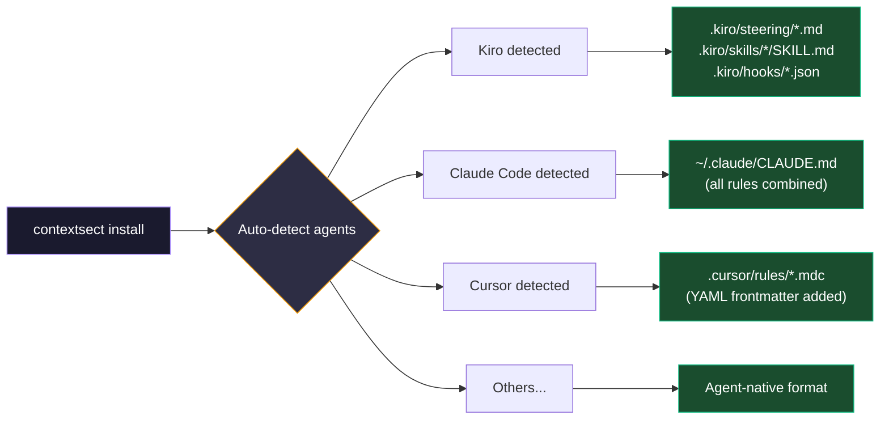

# Installation

## Quick Start

```bash
curl -sL https://contextsect.vercel.app/install.sh | bash
```

The script **auto-detects** which agents you have installed, installs the `contextsect` CLI globally, and configures each agent in its native format.

---

## CLI

After installation, the `contextsect` command is available globally:

```bash
contextsect install                     # Auto-detect agents + interactive profile
contextsect install --profile balanced  # Non-interactive install
contextsect update                      # Pull latest rules + reinstall
contextsect profile aggressive          # Switch to a different profile
contextsect status                      # Show installed agents, profile, version
contextsect uninstall                   # Remove all rules from all agents
contextsect version                     # Show version
```

### Common Workflows

```bash
# Update rules (from anywhere)
contextsect update

# Switch profile
contextsect profile aggressive

# Check what's configured
contextsect status

# Install for specific agents only
contextsect install --agent kiro,claude-code --profile balanced
```

---

## What Happens on Install



---

## Manual Agent Selection

If auto-detection doesn't find your agents, the script falls back to interactive selection:

```
Available agents:
  1) Kiro CLI
  2) Claude Code
  3) Cursor
  4) Windsurf
  5) Cline
  6) OpenCode
  7) Aider
  8) RooCode
  9) GitHub Copilot
 10) OpenAI Codex
  a) All

Select agents (comma-separated numbers, or 'a' for all): 1,2,3
```

## Explicit Agent + Profile

```bash
contextsect install --agent kiro,claude-code,cursor --profile aggressive
```

---

## Updating

```bash
# From anywhere (recommended)
contextsect update

# Or manually
contextsect update
```
