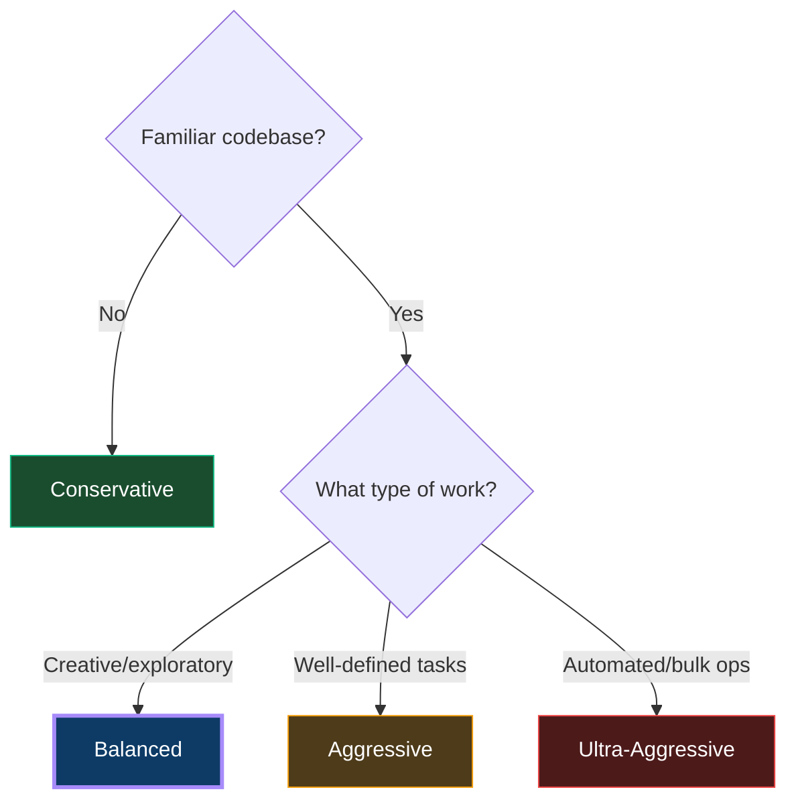

# Configuration Profiles

4 pre-configured intensity levels — works with any agent.

## Overview

| Profile | Input ↓ | Output ↓ | Risk | Best For |
|---------|:-------:|:--------:|:----:|----------|
| **Conservative** | 15–25% | 20–30% | Zero | Learning, prototyping, unfamiliar codebases |
| **Balanced** ⭐ | 40–55% | 50–65% | Low | Daily development (recommended default) |
| **Aggressive** | 60–75% | 70–85% | Medium | Cost-sensitive, familiar codebases |
| **Ultra-Aggressive** | 80–90% | 85–95% | High | Automated agents, bulk operations |

### How to Choose



---

## Automatic Setup (via install.sh)

```bash
# First install — interactive profile selection with examples
./install.sh

# Set profile via flag (non-interactive, CI-friendly)
./install.sh --profile balanced

# Change profile anytime (re-runs installation with new profile)
./install.sh --profile aggressive

# Combine flags
./install.sh --agent kiro,claude-code --profile conservative
```

### What You'll See on First Install

```
Select optimization profile:

  1) conservative    — Zero risk. Full exploration. Minimal constraints.
     Savings: Input: -15–25% | Output: -20–30% | Risk: Zero

  2) balanced ⭐     — Recommended. Significant savings with minimal friction.
     Savings: Input: -40–55% | Output: -50–65% | Risk: Low

  3) aggressive      — Maximum savings for familiar codebases. Tight budgets.
     Savings: Input: -60–75% | Output: -70–85% | Risk: Medium

  4) ultra-aggressive — Absolute minimum tokens. Automated/repetitive tasks only.
     Savings: Input: -80–90% | Output: -85–95% | Risk: High

  Recommended: balanced (best tradeoff for daily development)

  Choose profile [1-4, default=2]:
```

---

## What the Installer Does Per Agent

The selected profile is injected into each agent's config in its **native format**:

| Agent | Profile File Created |
|-------|---|
| Kiro | `~/.kiro/steering/000-profile.md` |
| Claude Code | Profile header prepended to `~/.claude/CLAUDE.md` |
| Cursor | `~/.cursor/rules/000-profile.mdc` (with YAML frontmatter) |
| Windsurf | `~/.windsurf/rules/000-profile.md` |
| Cline | `~/.clinerules/000-profile.md` |
| RooCode | `~/.roo/rules/000-profile.md` |
| OpenCode | Profile header in `~/opencode.md` |
| Aider | Profile header in `~/.aider.conventions.md` |
| GitHub Copilot | Profile header in `~/.github/copilot-instructions.md` |
| Codex | Profile header in `~/AGENTS.md` |

The `000-` prefix ensures the profile loads FIRST, before any other rules.

---

## Settings Per Profile

| Setting | Conservative | Balanced | Aggressive | Ultra-Aggressive |
|---------|---|---|---|---|
| Alignment gate | Disabled | 3+ files | 2+ files | ALL multi-step |
| Output compression | Lite | Full | Ultra | Ultra-max |
| Search-first | Advisory | Enforced | Strict (30 lines) | Symbol-only |
| Loop detection | 5 reps | 3 reps | 2 reps | 1 rep |
| Plan required | Disabled | 3+ files | 2+ files | ALL >1 file |
| Investigation budget | 10 calls | 5 calls | 3 calls | 2 calls |

---

## Mid-Session Profile Switching

You can also tell any agent mid-conversation:

| Command | Effect |
|---------|--------|
| `"use conservative mode"` | Full exploration, minimal constraints |
| `"use balanced mode"` | Standard optimization (recommended) |
| `"go aggressive"` | Tight constraints, familiar code only |
| `"ultra mode"` | Maximum savings, well-defined tasks only |
| `"skip alignment"` / `"just do it"` | Bypass alignment gate for current task |
