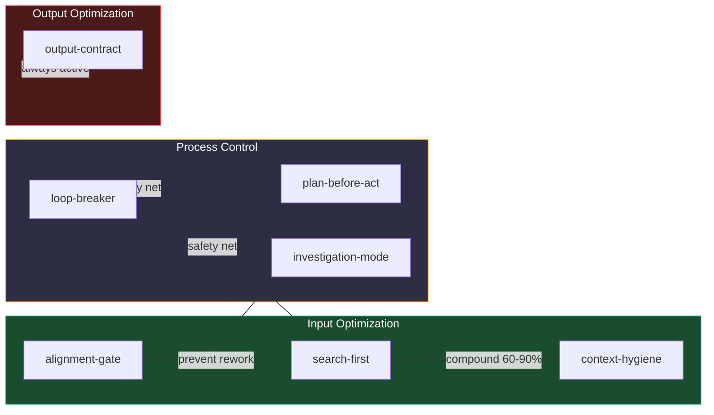
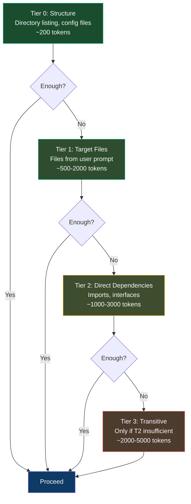

# Rules

8 universal rules — each works independently across all agents.

## Overview

| Rule | Purpose | Input Savings | Output Savings |
|------|---------|:---:|:---:|
| **output-contract** | Zero filler, no narration, explain only when asked | — | -40–65% |
| **diff-only** | SEARCH/REPLACE format, never full files | — | -60–90% code |
| **alignment-gate** | Clarify before complex tasks | -50–70% rework | -50–70% rework |
| **search-first** | Targeted search before file reads | -40–80% | -20–30% |
| **loop-breaker** | Halt stuck execution patterns | ∞ prevention | ∞ prevention |
| **plan-before-act** | Plan multi-file changes | +5% planning | -50–70% rework |
| **investigation-mode** | Evidence-first debugging | -40–60% | -50% |
| **context-hygiene** | Progressive loading, session awareness | -30–50% | indirect |

---

## Rule Synergies

---

## Implementation Priority

### Week 1 — Immediate, Zero Risk
| Rule | Impact |
|------|--------|
| `output-contract` | -40–65% output tokens instantly |
| `diff-only` | -60–90% code output tokens |
| `alignment-gate` | Prevents wrong-direction waste |

### Week 2 — After Validating
| Rule | Validates |
|------|-----------|
| `search-first` | File read patterns improve |
| `loop-breaker` | Stuck patterns caught |
| `plan-before-act` | Multi-file alignment |

### Week 3+ — Tune Thresholds
- If alignment gate fires too often (>50%): raise file-count threshold
- If loop-breaker false-positives: raise repetition threshold
- If sessions still bloat: enable `context-hygiene` strictly

---

## Progressive Context Loading

Load context in tiers — never all at once:

**Why:** The "Lost in the Middle" paper shows models pay most attention to beginning and end of context. Loading everything fills the middle with noise that DEGRADES quality. Less context = better reasoning.
