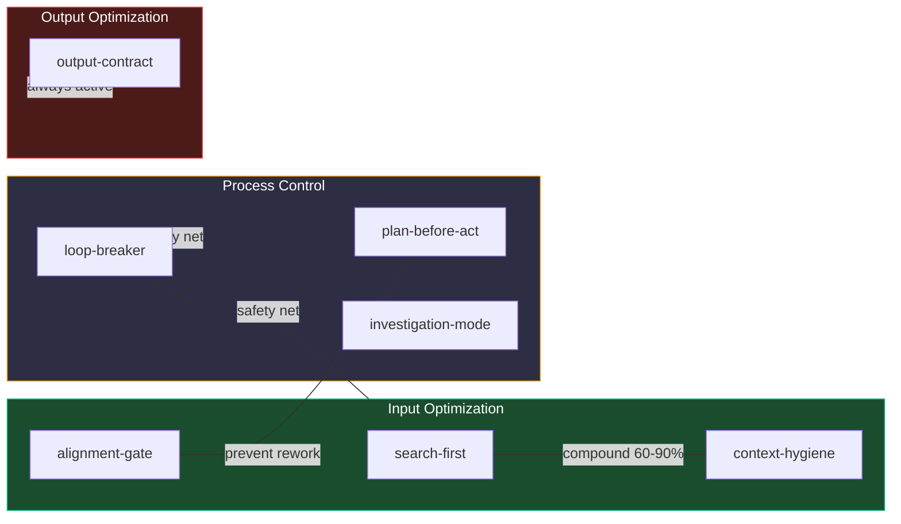
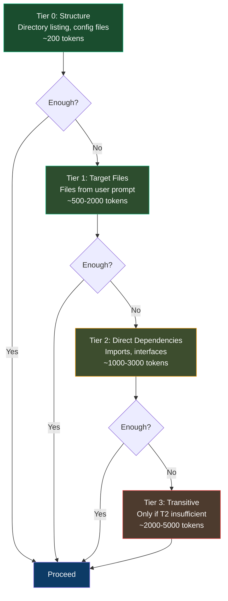

# Rules

8 universal rules — each works independently across all agents.

## Overview

| Rule | Purpose | Input Savings | Output Savings |
|------|---------|:---:|:---:|
| **output-contract** | Zero filler, no narration, explain only when asked | — | -40–65% |
| **diff-only** | SEARCH/REPLACE format, never full files | — | -60–90% code |
| **alignment-gate** | Clarify before complex tasks | -50–70% rework | -50–70% rework |
| **search-first** | Targeted search before file reads | -40–80% | -20–30% |
| **loop-breaker** | Halt stuck execution patterns | ∞ prevention | ∞ prevention |
| **plan-before-act** | Plan multi-file changes | +5% planning | -50–70% rework |
| **investigation-mode** | Evidence-first debugging | -40–60% | -50% |
| **context-hygiene** | Progressive loading, session awareness | -30–50% | indirect |

---

## Rule Synergies

```mermaid
flowchart LR
    subgraph INPUT["Input Optimization"]
        SF[search-first]
        CH[context-hygiene]
        AG[alignment-gate]
    end
    
    subgraph PROCESS["Process Control"]
        LB[loop-breaker]
        PB[plan-before-act]
        IM[investigation-mode]
    end
    
    subgraph OUTPUT["Output Optimization"]
        OC[output-contract]
    end

    SF ---|"compound 60-90%"| CH
    AG ---|"prevent rework"| PB
    LB ---|"safety net"| INPUT
    LB ---|"safety net"| PROCESS
    OC ---|"always active"| OUTPUT

    style INPUT fill:#1a4d2e,stroke:#10b981,color:#fff
    style PROCESS fill:#2d2d44,stroke:#f59e0b,color:#fff
    style OUTPUT fill:#4d1a1a,stroke:#ef4444,color:#fff
```

---

## Implementation Priority

### Week 1 — Immediate, Zero Risk
| Rule | Impact |
|------|--------|
| `output-contract` | -40–65% output tokens instantly |
| `diff-only` | -60–90% code output tokens |
| `alignment-gate` | Prevents wrong-direction waste |

### Week 2 — After Validating
| Rule | Validates |
|------|-----------|
| `search-first` | File read patterns improve |
| `loop-breaker` | Stuck patterns caught |
| `plan-before-act` | Multi-file alignment |

### Week 3+ — Tune Thresholds
- If alignment gate fires too often (>50%): raise file-count threshold
- If loop-breaker false-positives: raise repetition threshold
- If sessions still bloat: enable `context-hygiene` strictly

---

## Progressive Context Loading

Load context in tiers — never all at once:

```mermaid
flowchart TD
    T0["Tier 0: Structure<br/>Directory listing, config files<br/>~200 tokens"] --> D0{Enough?}
    D0 -->|Yes| DONE[Proceed]
    D0 -->|No| T1["Tier 1: Target Files<br/>Files from user prompt<br/>~500-2000 tokens"]
    T1 --> D1{Enough?}
    D1 -->|Yes| DONE
    D1 -->|No| T2["Tier 2: Direct Dependencies<br/>Imports, interfaces<br/>~1000-3000 tokens"]
    T2 --> D2{Enough?}
    D2 -->|Yes| DONE
    D2 -->|No| T3["Tier 3: Transitive<br/>Only if T2 insufficient<br/>~2000-5000 tokens"]
    T3 --> DONE

    style T0 fill:#1a4d2e,stroke:#10b981,color:#fff
    style T1 fill:#2d4d2e,stroke:#10b981,color:#fff
    style T2 fill:#3d4d2e,stroke:#f59e0b,color:#fff
    style T3 fill:#4d3b2e,stroke:#ef4444,color:#fff
    style DONE fill:#0d3b66,stroke:#a78bfa,color:#fff
```

**Why:** The "Lost in the Middle" paper shows models pay most attention to beginning and end of context. Loading everything fills the middle with noise that DEGRADES quality. Less context = better reasoning.

---

## Activation Tiers

There are 14 rules, but they are not all always-loaded. Each is assigned a tier based on when it actually needs to act. Full rationale in [tiering.md](tiering.md).

| Tier | Rules | Cost when idle |
|---|---|---|
| **steering** (2) | `output-contract`, `cache-stability` | full, but cache-warm |
| **hook** (6) | `alignment-gate`, `loop-breaker`, `search-first`, `shell-output-hygiene`, `context-budget`, `diff-only` | zero until the event fires |
| **skill** (6) | `plan-before-act`, `investigation-mode`, `context-hygiene`, `tool-selection`, `subagent-isolation`, `session-handover` | description only |

On Kiro this cuts always-on content from 14 rules to 2 — measured at ~4,300 words down to ~700.

## The Three Newer Rules

### 12. Cache Stability (`rules/cache-stability.md`)
**Purpose:** Keep the prompt prefix byte-stable so provider prompt caching stays warm.
- Cache reads cost roughly 10% of normal input price, but matching is byte-exact
- Stable content first, volatile content last; never inject timestamps early
- Do not re-summarise history mid-session — rewriting the prefix drops the cache
- **Tier:** steering. Stability dominates size: a larger stable prefix beats a smaller volatile one

### 13. Subagent Isolation (`rules/subagent-isolation.md`)
**Purpose:** Keep exploration out of the main context.
- Delegate read-heavy work with an unknown target; ask for a conclusion, not a transcript
- Treat subagent output as your own file reads — do not re-read what it reported
- **Tier:** skill. The saving is that raw material never enters the main window

### 14. Session Handover (`rules/session-handover.md`)
**Purpose:** Survive compaction by keeping state on disk instead of in context.
- Record decisions **and their reasons** — reasons are what compaction destroys first
- Reference code by `path:line`; never paste file contents
- Update as work progresses, not once at the end
- **Tier:** skill. Compaction is lossy and usually not configurable, so a fresh session plus a handover file beats a long session

## Adding a Rule

1. Add `rules/<name>.md` as plain, agent-agnostic markdown
2. Register it in `get_rule_tier()` and `get_rule_description()` in `install.sh`
3. If it is `hook` tier, add an entry to the relevant `adapters/*-hooks.json`

Unregistered rules default to `steering` — over-charged rather than silently skipped.

For `skill` tier the description **is** the activation trigger, so write it as a trigger condition ("Use when…", "Use before…"), not a summary. A vague description means the skill never fires, which silently drops the rule.
